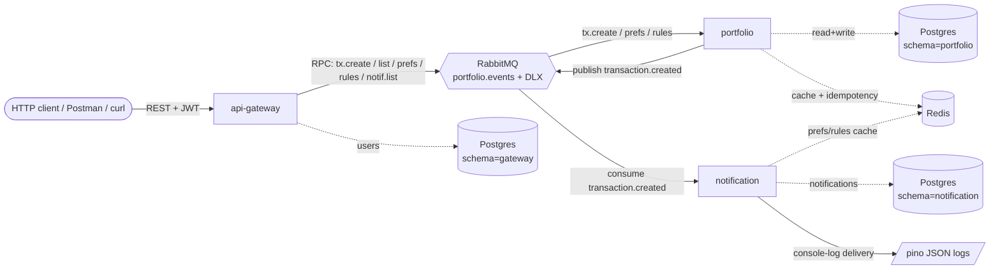

# Acumen — Portfolio Activity & Notification System

A small microservices system that ingests user portfolio transactions and turns them into preference-aware notifications, end to end. Three Node services talk to each other over RabbitMQ, persist to per-schema Postgres, and use Redis for read-cache and idempotency.

> **Reference**: `Backend Assesment test PDF.pdf` (committed at repo root).

---

## 1. Overview



**Services**

| Service | Role | Public surface | Internal surface |
|---|---|---|---|
| `api-gateway` | Auth + REST facade. Issues JWT, fans out to RPC over RMQ. | `/auth/*`, `/portfolio/transactions`, `/preferences`, `/rules`, `/notifications`, `/healthz` | RPC client to `portfolio` + `notification` |
| `portfolio` | Owns transactions, preferences, rules. Publishes `transaction.created`. | RMQ only (+ `/healthz`) | RPC server, event publisher |
| `notification` | Consumes `transaction.created`, applies prefs/rules, persists Notification, "delivers" via pino log. DLX retry with backoff. | RMQ only (+ `/healthz`) | RPC server (list), event consumer |

---

## 2. Architecture decisions

- **NestJS + Fastify (TypeScript strict)** — productive HTTP layer with DI, validation pipes, and a fast adapter; a single mental model across all three services.
- **RabbitMQ as the only inter-service transport** — push the transactional + retry-with-backoff guarantees down to the broker (DLX + retry queue) instead of re-implementing them in app code. Makes failure paths observable in the management UI.
- **Single Postgres, schema-per-service** — strong isolation (each Prisma schema owns its tables, migrations, and client) without the operational tax of running 3 databases. `gateway`, `portfolio`, `notification` schemas are created at init by `docker/postgres-init.sql`.
- **Prisma per app** — each app generates its own client, has its own `prisma/schema.prisma`, and runs its own `migrate deploy`. No cross-service ORM coupling.
- **Redis** for the `tx:list:{userId}` read cache (30s TTL, invalidated on write) and idempotency keys. Optional but lets us demonstrate cache invalidation discipline.
- **JWT (HS256)** — symmetric key in `JWT_SECRET` (zod-validated min length 32). Gateway is the only issuer; `userId` propagates via RPC payload, never via re-decoding the token in downstream services.
- **pino with redaction** — every service uses `createLogger(name)` from `@acumen/shared`. Redact list (`authorization`, `password`, `email`, `token`, `phone`, `passwordHash`) is centralized; tag prefixes (`API_*`, `FEATURE_*`, `ERROR_*`) are conventions enforced by code review.
- **Biome** for lint + format — single tool, fast, no eslint/prettier coordination overhead.
- **Vitest + Testcontainers** — integration tests boot real Postgres + real RabbitMQ. No infra mocks. One high-ROI integration test per service.
- **Devcontainer** — Node 22 + pnpm 10 + docker-cli pinned via `.devcontainer/Dockerfile`; `docker-compose.dev.yml` brings up infra-only containers so the VS Code workspace is reproducible cold.

---

## 3. Tradeoffs considered

| Decision | Alternative | Why we chose this |
|---|---|---|
| RMQ-only inter-service | gRPC / direct HTTP | DLX + retry semantics out of the box. Acceptable latency for trade events (<100ms locally). Gives a clean event-sourcing entry point for future fan-out. |
| Schema-per-service in one Postgres | Database-per-service | Lower local + CI footprint; still gives isolation at the migration + role level. Easy to split later by extracting a schema. |
| Console-log "delivery" | MailHog / Mailpit / Twilio sandbox | Spec calls for demonstration of the pipeline, not real delivery. A pino log line is byte-for-byte verifiable in tests and Loki/Cloud-Logging-friendly. |
| BullMQ vs RabbitMQ DLX | BullMQ on Redis | RabbitMQ already in the stack as the transport — adding a second queueing system to do retries would split observability. DLX + TTL gives backoff retry natively. |
| Biome over ESLint+Prettier | ESLint + Prettier | One binary, one config, dramatically faster. The few capabilities we miss (e.g. nested-config workspace mode) we work around with per-app `biome.json` extending root. |
| `class-validator` | zod at controller layer | Plays nicely with NestJS pipes/decorators. We do use zod at message-handler boundaries inside services for RPC payload validation. |
| pnpm workspaces | Turborepo / Nx | Monorepo orchestration is light here (3 apps + 1 shared pkg). pnpm + raw `-r` scripts is sufficient and adds zero new tooling surface. |

---

## 4. Scalability considerations

- **Stateless services behind RMQ load-balanced queues.** Every consumer queue is competing-consumer; horizontal scale = run more replicas. Prefetch is bounded (default 10) so a slow consumer doesn't choke the queue.
- **Partitioning by `userId`.** Today there's a single queue per pattern; introducing consistent-hash exchanges keyed by `userId` would let us shard load while preserving per-user ordering.
- **Cache hierarchy.** `tx:list:{userId}` invalidates on write; prefs/rules cached in Notification with 60s TTL since stale-by-a-minute is acceptable. Both keys are user-scoped so cache stampedes are bounded.
- **DLQ alerting.** `notification.transaction.created.dlq-final` is the terminal queue. In production, a length > 0 alert routes to oncall — `ERROR_NOTIFICATION_DLQ_FINAL` is the log key to filter on.
- **Future shard plan.** Postgres schema-per-service means we can lift one schema to its own instance without app code changes — only the `DATABASE_URL_*` for that service needs to flip. RabbitMQ topology is preloaded from `docker/rabbitmq/definitions.json`, which doubles as our IaC source of truth.
- **Backpressure.** Gateway calls are bounded by `RpcClient` timeout; Portfolio + Notification respect prefetch and manual ack. Slow consumers redeliver via DLX retry, capped at `MAX_RETRIES=3` (inspected via `x-death`) before terminal DLQ.

---

## 5. Run locally

### 5.1 Prerequisites

- Node 22 LTS (`.nvmrc` pinned)
- pnpm 10 (`packageManager` pinned)
- Docker + Docker Compose v2

```bash
# install Node version manager helper
nvm use   # picks up .nvmrc → 22

corepack enable   # enables pnpm@10 declared in package.json
```

### 5.2 Devcontainer (recommended)

In VS Code: **Reopen in Container**. The devcontainer:
- Builds `.devcontainer/Dockerfile` (Node 22, pnpm 10, docker-cli, jq, psql, redis-tools).
- Brings up Postgres + RabbitMQ + Redis via `docker/docker-compose.dev.yml`.
- Runs `pnpm install --frozen-lockfile` and `pnpm prisma:generate` on first create.

Forwarded ports: `3000`, `3001`, `3002`, `55432`, `5673`, `15673`, `6380`.

### 5.3 Manual (no devcontainer)

```bash
pnpm install --frozen-lockfile
pnpm dev:setup                   # = compose:up:infra + prisma:migrate + seed (idempotent)
pnpm dev                         # gateway + portfolio + notification (concurrently)
```

Each per-app script (`dev`, `start`, `prisma:generate`, `prisma:migrate`, `prisma db seed`) loads `.env` via `dotenv -e ../../.env --`, so `pnpm --filter @acumen/<app> dev` works the same as the root command. No per-app `.env` is required.

For the canonical step-by-step API tour (13 ordered steps that mirror `pnpm journey` and the Postman collection), read **`docs/USER_JOURNEY.md`**.

Smoke (curl):

```bash
curl -s -X POST localhost:3000/auth/register \
  -H 'content-type: application/json' \
  -d '{"email":"smoke@local","password":"Passw0rd!"}'

TOKEN=$(curl -s -X POST localhost:3000/auth/login \
  -H 'content-type: application/json' \
  -d '{"email":"smoke@local","password":"Passw0rd!"}' | jq -r .token)

curl -s -X POST localhost:3000/portfolio/transactions \
  -H "authorization: Bearer $TOKEN" -H 'content-type: application/json' \
  -d '{"symbol":"AAPL","type":"BUY","qty":1,"price":100}'

sleep 2
curl -s -H "authorization: Bearer $TOKEN" localhost:3000/notifications | jq
```

### 5.4 Full stack (apps + infra in compose)

```bash
pnpm compose:up                  # builds app images + brings up everything
pnpm prisma:migrate
pnpm seed
pnpm journey                     # scripted user journey (3 users × 3 tx)
pnpm postman                     # newman runs the Postman collection
pnpm compose:down                # tear down + remove volumes
```

### 5.5 Tests

```bash
pnpm lint                # biome check
pnpm -r build            # nest build + tsc per package
pnpm -r test:integration # vitest + testcontainers per service (60-180s total)
```

---

## 6. Service catalog

| Service | Host port | Health | Key env | Queues |
|---|---|---|---|---|
| api-gateway | `3000` | `GET /healthz` | `GATEWAY_PORT`, `JWT_SECRET`, `DATABASE_URL_GATEWAY`, `RABBITMQ_URL` | RPC client to `portfolio.commands.*`, `notification.rpc.list` |
| portfolio | `3001` (healthz) | `GET /healthz` | `PORTFOLIO_HEALTH_PORT`, `DATABASE_URL_PORTFOLIO`, `RABBITMQ_URL`, `REDIS_URL` | RPC server `portfolio.commands.*`; publisher on `portfolio.events` |
| notification | `3002` (healthz) | `GET /healthz` | `NOTIFICATION_HEALTH_PORT`, `DATABASE_URL_NOTIFICATION`, `RABBITMQ_URL`, `REDIS_URL` | Consumer `notification.transaction.created` (+ retry + dlq-final); RPC server `notification.rpc.list` |
| postgres | `55432` | `pg_isready` | `POSTGRES_USER`, `POSTGRES_PASSWORD`, `POSTGRES_DB` | n/a |
| rabbitmq | `5673` (amqp), `15673` (mgmt) | `rabbitmq-diagnostics ping` | `RABBITMQ_USER`, `RABBITMQ_PASSWORD` | exchanges + queues preloaded via `docker/rabbitmq/definitions.json` |
| redis | `6380` | `redis-cli ping` | n/a | n/a |

### REST endpoints (gateway)

| Method | Path | Auth | Body |
|---|---|---|---|
| `POST` | `/auth/register` | — | `{ email, password }` |
| `POST` | `/auth/login` | — | `{ email, password }` → `{ token, userId, email }` |
| `POST` | `/portfolio/transactions` | Bearer | `{ symbol, type: BUY\|SELL, qty, price, idempotencyKey? }` |
| `GET` | `/portfolio/transactions` | Bearer | — |
| `POST` | `/preferences` | Bearer | `{ channel: EMAIL\|SMS\|PUSH, enabled }` |
| `GET` | `/preferences` | Bearer | — |
| `POST` | `/rules` | Bearer | `{ eventType: TRADE_EXECUTED, enabled }` |
| `GET` | `/notifications` | Bearer | — |
| `GET` | `/healthz` | — | — |

### Seed data

`pnpm seed` is idempotent (`upsert` keyed on stable UUIDs). After running:

| Schema | Rows |
|---|---|
| `gateway."User"` | 3 (alice, bob, carol @seed.local — password `Passw0rd!`) |
| `portfolio."UserPreference"` | 3 |
| `portfolio."NotificationRule"` | 3 |
| `portfolio."Transaction"` | 15 (5 per user, deterministic UUIDs) |
| `notification."Notification"` | 0 by default (set `SEED_FIXTURES=1` for samples) |

---

## 7. Troubleshooting

| Symptom | Likely cause | Fix |
|---|---|---|
| `pnpm install` fails on lockfile mismatch | Wrong pnpm version | `corepack enable && corepack prepare pnpm@10.33.0 --activate` |
| `prisma migrate deploy` errors `schema "portfolio" does not exist` | Postgres init didn't run | `pnpm compose:down -v` then `pnpm compose:up:infra`; init script only runs on a fresh volume |
| Gateway `/healthz` returns `degraded` | RMQ not connected | Check `docker logs acumen-rabbitmq`; verify `definitions.json` mounted; mgmt UI on `localhost:15673` (acumen/acumen) |
| Notifications never appear | User pref or rule disabled | `psql -d acumen -c 'select * from portfolio."UserPreference"; select * from portfolio."NotificationRule"'` — both must have `enabled=true` |
| `pnpm -r test:integration` times out | Testcontainers needs Docker socket | Confirm `docker ps` works; on macOS allow Docker in Settings → Resources |
| `pnpm journey` exits with `gateway never became healthy` | Stack not up or wrong port | `pnpm compose:up && curl localhost:3000/healthz`; override with `BASE_URL=http://localhost:3000 pnpm journey` |
| Newman fails on poll step | Notification truly didn't arrive | Check `docker logs acumen-notification` for `ERROR_*` keys; inspect DLX queue `notification.transaction.created.retry` in mgmt UI |
| Port collision on `5432`/`5672`/`6379` | Native services running | Host ports are `55432` / `5673`+`15673` / `6380` precisely to avoid this — verify with `lsof -i:55432` |

---

## 8. Out of scope

Per the spec, the following are explicit non-goals:
- Real email / SMS / push delivery (console-log only).
- Live market data or price feeds.
- Holdings aggregation, P&L computation.
- Distributed tracing (OTel/Jaeger).
- Frontend / UI.
- Multi-tenant / org model.
- Rate limiting beyond Nest defaults.
- Production-grade secret management — env vars only, validated by zod at boot.

---

## 9. Repository layout

```
acumen/
├── apps/
│   ├── api-gateway/          # NestJS + Fastify HTTP facade
│   ├── portfolio/            # NestJS + RMQ microservice + Prisma + Redis
│   └── notification/         # NestJS + RMQ consumer + DLX retry
├── packages/
│   └── shared/               # logger, env, contracts, queue/exchange constants
├── docker/
│   ├── docker-compose.yml    # full stack (apps + infra)
│   ├── docker-compose.dev.yml# infra-only (devcontainer + manual dev)
│   ├── postgres-init.sql     # CREATE SCHEMA gateway, portfolio, notification
│   └── rabbitmq/             # rabbitmq.conf + definitions.json (exchanges + DLX)
├── .devcontainer/            # VS Code devcontainer (Node 22, pnpm 10)
├── .github/workflows/ci.yml  # quality + integration jobs (+ optional e2e)
├── prisma/seed/              # shared seed dataset (SEED_USERS, SEED_SYMBOLS)
├── scripts/user-journey.mjs  # sequential per-user e2e simulator
├── postman/                  # Postman collection + environment (Newman runnable)
└── README.md
```
