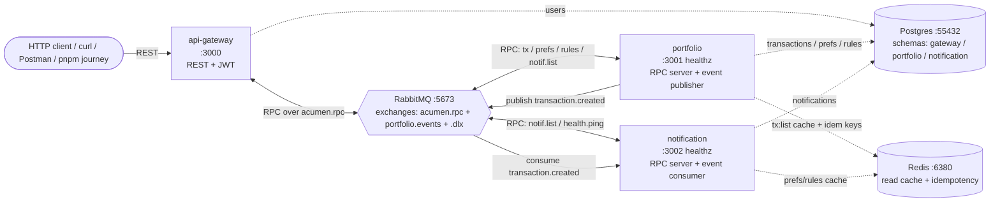
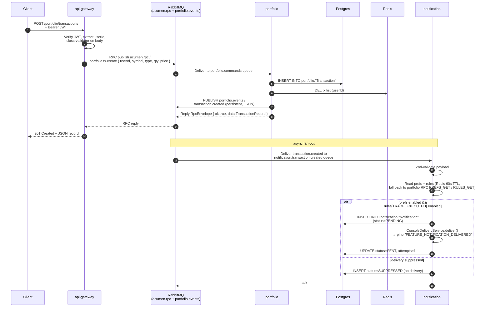

# Architecture Overview

A 5-minute big-picture tour of the Acumen repo. For deeper material:
- `README.md` — full architecture + decisions/tradeoffs/scalability.
- `docs/USER_JOURNEY.md` — the 13-step API tour.
- `docs/explain-repo.md` — recruiter-facing run guide.

---

## 1. The system in one diagram



Three Node services, one Postgres (schema-per-service), one RabbitMQ, one Redis. RMQ is the only inter-service transport — services never call each other over HTTP.

---

## 2. What each app does

### 2.1 `apps/api-gateway` — REST facade + JWT issuer

| Concern | Detail |
|---|---|
| **Public surface** | `/auth/register`, `/auth/login`, `/portfolio/transactions` (POST + GET), `/preferences` (POST + GET), `/rules` (POST), `/notifications` (GET), `/healthz` |
| **Owns** | `gateway.users` table (email, passwordHash). Issues HS256 JWTs (`JWT_SECRET` ≥ 32 chars). |
| **Talks to peers via** | `RpcClient` (`apps/api-gateway/src/common/rmq/rpc.client.ts`) on the `acumen.rpc` topic exchange. Never decodes the JWT in downstream services — `userId` rides on the RPC payload. |
| **Failure mapping** | `AllExceptionsFilter` (`apps/api-gateway/src/common/filters/all-exceptions.filter.ts`) maps RPC envelope `code` → HTTP status: `VALIDATION_ERROR → 400`, `UNAUTHORIZED → 401`, `NOT_FOUND → 404`, `CONFLICT → 409`, `RPC_TIMEOUT → 503`. |
| **Healthz** | Probes db (`SELECT 1 FROM gateway."users" LIMIT 1`), rmq (`assertExchange`), and runs a 1.5s `health.ping` RPC round-trip to portfolio + notification. |

### 2.2 `apps/portfolio` — domain owner + event publisher

| Concern | Detail |
|---|---|
| **Public surface** | None over HTTP (only `/healthz` for ops). All work is RPC-driven. |
| **Owns** | `portfolio.Transaction`, `portfolio.UserPreference`, `portfolio.NotificationRule` tables + their migrations. |
| **RPC handlers** (`acumen.rpc`) | `portfolio.tx.create`, `portfolio.tx.list`, `portfolio.prefs.set`, `portfolio.prefs.get`, `portfolio.rules.set`, `portfolio.rules.get`, `portfolio.health.ping`. Each handler is a `@RabbitRPC` method on an `@Injectable` controller, returns an `RpcEnvelope` (`{ok:true,data}` or `{ok:false,error:{code,message,details}}`). |
| **Event publisher** | After `transactions.service.ts:create` writes to Postgres + invalidates `tx:list:{userId}` in Redis, it publishes `transaction.created` to the `portfolio.events` topic exchange (persistent, JSON). |
| **Cache** | `tx:list:{userId}` 30s TTL, invalidated on every write. |

### 2.3 `apps/notification` — event consumer + delivery

| Concern | Detail |
|---|---|
| **Public surface** | None over HTTP (only `/healthz`). |
| **Owns** | `notification.Notification` table. |
| **Subscriber** | `TransactionCreatedConsumer` binds queue `notification.transaction.created` to `portfolio.events` on routing key `transaction.created`. Manual ack, prefetch 10. |
| **RPC handlers** | `notification.list` (paginated history per user), `notification.health.ping`. |
| **Outbound delivery** | `ConsoleDeliveryService` (`apps/notification/src/delivery/console-delivery.service.ts`) emits a single pino log line per delivered notification. Spec calls for demonstration of the pipeline, not real email/SMS. |
| **Cache** | Prefs + rules 60s TTL (stale-by-a-minute is acceptable). |

---

## 3. Flow: `POST /portfolio/transactions` end-to-end

This is the canonical happy path. Numbers in the diagram match the steps below.



Step-by-step in plain words:

1. Client POSTs the transaction to the gateway with a Bearer token.
2. Gateway validates the JWT (`JwtAuthGuard`) and the body (`class-validator`).
3. Gateway sends an RPC over `acumen.rpc` with routing key `portfolio.tx.create`. Timeout 8s (`RPC_TIMEOUT_MS`).
4. Portfolio receives it on its pre-declared `portfolio.commands` queue (topology in `docker/rabbitmq/definitions.json`; the `@RabbitRPC` handler attaches as a consumer).
5. Portfolio writes the row to Postgres and invalidates the `tx:list:{userId}` cache in Redis (so the next `GET /portfolio/transactions` is fresh).
6. Portfolio publishes the canonical `transaction.created` event on `portfolio.events`. This is the fan-out point — any service subscribed to that routing key gets it.
7. Portfolio replies to the gateway's RPC with the persisted record, wrapped in `{ok:true,data}`.
8. Gateway returns HTTP 201 to the client.
9. Independently, the notification service consumes the event from its `notification.transaction.created` queue.
10. It validates the payload (zod), looks up the user's prefs + rules (cached 60s, falls back to RPC against portfolio if cache miss), and decides whether to deliver.
11. If allowed, it inserts a `Notification` row with `status=PENDING`, fires the console-log delivery, then updates `status=SENT, attempts=1`.

The whole thing typically completes in 50-150ms locally, end-to-end.

---

## 4. Flow: failure / retry path

If the notification consumer throws (or returns NACK), RabbitMQ does the back-off for us. No app-level retry loop.

```mermaid
flowchart LR
  PE[portfolio.events<br/>routing: transaction.created] -->|deliver| Q1[notification.transaction.created<br/>queue]
  Q1 -.->|consumer throws / NACK| DLX[portfolio.events.dlx]
  DLX -->|routing: transaction.created.retry| Q2[notification.transaction.created.retry<br/>x-message-ttl=5000ms]
  Q2 -.->|TTL expires, dead-letters| PE
  Q1 -. x-death.count >= MAX_RETRIES=3<br/>park as dead .-> DLX
  DLX -->|routing: transaction.created.failed| DLF[notification.transaction.created.dlq-final<br/>terminal]
  DLF -.->|alert| OPS[operator: ERROR_NOTIFICATION_DLQ_FINAL]
```

1. Consumer throws → message is NACKed (no requeue).
2. RabbitMQ dead-letters to `portfolio.events.dlx` with routing key `transaction.created.retry`.
3. The retry queue has `x-message-ttl=5000`. After 5s, the message dead-letters back to `portfolio.events` on `transaction.created` — meaning the original consumer sees it again.
4. The consumer reads `headers['x-death']` to count past delivery attempts on the original queue (`getRetryCount` in `apps/notification/src/consumers/transaction-created.consumer.ts`). Once it hits `MAX_RETRIES = 3` (`@acumen/shared/constants/messaging.ts`), the consumer publishes the message to `portfolio.events.dlx` with routing key `transaction.created.failed` and acks the original. The DLX is bound to `notification.transaction.created.dlq-final` on that key (`docker/rabbitmq/definitions.json` `bindings`), so the message lands in the terminal queue.
5. Anything in `dlq-final` is a real failure — log key `ERROR_NOTIFICATION_DLQ_FINAL`. In production this is what oncall pages on.

The full topology (exchanges, queues, bindings, TTLs) lives in `docker/rabbitmq/definitions.json` — single source of truth, loaded by RabbitMQ at boot.

---

## 5. Why these choices (1-line each)

| Decision | Why |
|---|---|
| RabbitMQ as the only inter-service transport | DLX + TTL gives backoff retry natively; no app-level retry loop, no second queue system. |
| One Postgres, schema-per-service | Strong isolation at the migration + role level without running 3 databases. Easy to split a schema out later. |
| Console-log "delivery" for notifications | Spec calls for the pipeline, not real delivery. Pino lines are byte-for-byte verifiable in tests. |
| `userId` propagated in RPC payload, not re-decoded JWT | Gateway is the only token issuer/verifier — keeps `JWT_SECRET` blast radius to one service. |
| `nest build --builder swc` for dev | Required: tsx/esbuild does NOT emit decorator metadata, breaking NestJS DI silently (gateway/portfolio/notification all hit this). See CLAUDE.md gotchas. |

---

## 6. Where to look in the code

| Concern | File |
|---|---|
| RPC client (gateway) | `apps/api-gateway/src/common/rmq/rpc.client.ts` |
| RPC envelope helper + types | `packages/shared/src/contracts/rpc.ts` |
| Routing keys, queues, exchanges | `packages/shared/src/constants/messaging.ts` |
| RabbitMQ topology (IaC source of truth) | `docker/rabbitmq/definitions.json` |
| Transaction write + event publish | `apps/portfolio/src/transactions/transactions.service.ts` |
| Event consumer + retry counting | `apps/notification/src/consumers/transaction-created.consumer.ts` |
| Console-log "delivery" | `apps/notification/src/delivery/console-delivery.service.ts` |
| Health probe (gateway) | `apps/api-gateway/src/health/health.controller.ts` |
| Prisma schemas (per service) | `apps/*/prisma/schema.prisma` |

---

For the API request/response shapes go to `docs/USER_JOURNEY.md`. For local-run instructions go to `docs/explain-repo.md`. For deeper architectural decisions and tradeoff reasoning go to `README.md` §2-§4.
